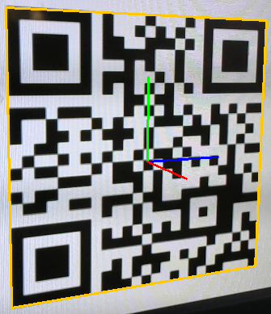
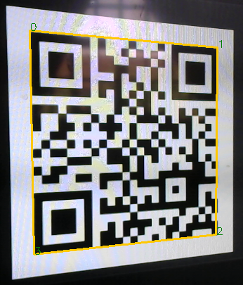
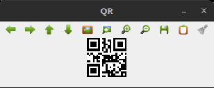

# Pose de un código QR o ARUCO

Este repositorio contiene código que ilustra cómo obtener la pose 3D (posición y orientación) de un código visual captado por la cámara.  Estos programas procesan las imágenes de la cámara y visualizan la detección en tiempo real.

Luego de una introducción a marcadores visuales, se describen los tres programas Python de este repositorio.

El documento [Sistema de visión artificial para taller de Álgebra](https://docs.google.com/document/d/1H9JPeI5YSvK_-AgQpwC-dRBQZGnRG82ntYrplfbunQ8/edit?tab=t.0) describe la composición y uso de una matriz de rototralación de 4x4 para expresar las poses en 3D.

Al terminar esta página conviene seguir con **[realidad aumentada](./ar.md)** que describe el uso de este código que determina la pose de un código QR, para implementar realidad aumentada, superponiendo un modelo 3D.

# Marcadores visuales QR ARUCO
Los códigos QR son marcadores visuales que codifican un texto.  Los algoritmos primero detectan la posición del código en la imagen y luego decodifican su contenido.

Muchas aplicaciones de visión artificial aprovecharon la capacidad de detectar el contorno de los códigos QR para determinar su posición en el espacio, ignorando completamente el mensaje codificado.

Los marcadores que permiten determinar su posición se conocen como **marcadores fiduciarios**.  Abundan las bibliotecas para detectar código QR, sin embargo no es el mejor marcador fiduciario, ése ni siquiera fue un criterio de diseño.

En 2014 en la Universidad de Córdoba (España) se desarrollaron los **marcadores ARUCO**, con la expresa intención de actuar como marcadores fiduciarios.  Son excelentes para determinar su posición, y su patrón no codifica un texto arbitrario sino un identificador.  A continuación se muestran 4 marcadores con identificadores unívocos:

Los marcadores ARUCO se convirtieron en los marcadores fiduciarios favoritos de la industria.

# Instalación

Usualmente basta con clonar el respositorio.

Las bibliotecas necesarias son las clásicas usadas en muchos otros proyectos de visión artificial:

- OpenCV
- Numpy

Se pueden instalar con pip:

    pip install numpy opencv-contrib-python

Los tres programas siguientes están totalmente contenidos en un único archivo, se pueden mover sin que se rompan.

# detectQR.py

Este programa localiza los vértices del código QR y los muestra en pantalla, delineando el contorno y numerando los 4 vértices de 0 a 3.

Para terminar pulsar ESC haciendo foco en la ventana del detector.  Es un error común pulsar ESC en la ventana de la IDE.

La cámara debe observar un código QR, que puede estar impreso en un papel, pero lo más práctico a la hora de testear el software y presentar el código en una pantalla, por ejemplo en la pantalla del celular.  Se puede mostrar el código QR que está más arriba.  La carpeta docs/images contiene dos códigos QR por conveniencia, que fácilmente se pueden mostrar en pantalla.

Con este programa se pueden testear condiciones extremas de detección, como una observación parcial, un QR curvado o rugoso, o condiciones de mala iluminación.

*Probá observar el código QR no de frente sino en ángulo, a ver hasta qué angulo lo detecta.*

Además, detectQR.py muestra el código alineado que internamente se envía al decodificador:

# poseQR.py

Este programa es una ampliacíon del anterior, que usa la detección de los 4 vértices para computar la pose del marcador.  Sobre el marcador detectado anota una terna de coordenadas roja, verde y azul, que simboliza que ha encontrado la pose 3D del marcador.

Se observa que el origen de coordenadas del marcador se colocó en su centro.  Esto es una elección arbitraria pero conveniente.

La detección de QR se realiza en esta línea:

    ret, qrs = det.detect(im)

Se usa un detector unitario, por lo que sólo puede detectar un QR en la imagen.  El código se puede cambiar fácilmente para adoptar un detector de múltiples códigos QR.

En qrs están las coordenadas en píxeles de los 4 vértices del marcador.

Como no es posible obtener la escala a partir de una imagen, el código introduce la variable `squareLength`, que representa la longitud del lado del marcador cuadrado.  Ese valor se debe modificar en el código para que las posiciones espaciales calculadas sean correctas.

Por ejemplo, si el marcador mide 10 cm de lado, se puede poner en el código:

    squareLength = 10

Las posiciones espaciales calculadas por la homografía estarán expresadas en las mismas unidades, cm en este ejemplo.

El código determina la pose con la función `cv.solvePnP()`, y la expresa de dos maneras:

- tvec y rvec
  - tvec es el *vector traslación* que indica la posición del marcador respecto de la cámara
  - rvec es la rotación en notación Rodrigues
  - ambos se usan en `cv.projectPoints()` para la anotación
- Tcq
  - matriz de 4x4 de rototraslación
  - calculada a partir de tvec y rvec
  - convierte puntos en el sistema de coordenadas del marcador al sistema de coordenadas de la cámara

El algoritmo requiere cámara calibrada: coeficientes de distorsión y matriz intrínseca.
Por conveniencia, para poder ejecutar la demo sin calibrar, los coeficientes vienen en cero y se compone una matriz intrínseca aproximada para una cámara común.

# poseARUCO.py

Hace lo mismo que poseQR.py, pero con marcadores ARUCO.

[En este video](https://drive.google.com/file/d/1m3P5Bqe_TIiv7NxCw4hy-tt40ApnPkf1/view?usp=drive_link) se puede apreciar el funcionamiento de `poseARUCO.py`.

El código usa el diccionario ARUCO predefinido, `cv::aruco::DICT_4X4_50`, el más simple que existe, con 50 marcadores con bloques de 4x4:

La línea

    corners, ids, rejectedImgPoints = det.detectMarkers(im)

detecta los marcadores ARUCO en la imagen y devuelve sus esquinas, que luego se usan para computar las poses.  El detector es múltiple, detecta todos los marcadores ARUCO que haya en la imagen, siempre que se vean por completo.  También los decodifica e informa sus ids, que para este diccionario es un número de 0 a 49.

Los marcadores ARUCO son mucho más precisos que los códigos QR como marcadores fiduciarios, y recomendados en el laboratorio y en general, excepto cuando se necesite contener un texto, cosa que ARUCO no puede hacer.